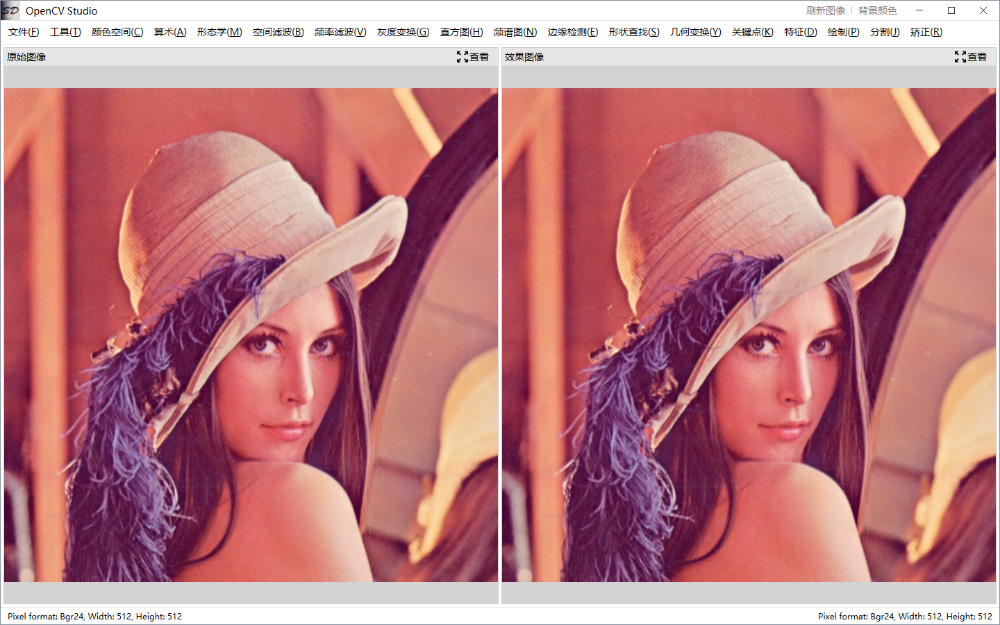

### 框架地址：https://gitee.com/lishilei0523/SD.Framework

## 项目说明

    本项目开发的目的有四：

        1、探索OpenCV常用图像算法；
        
        2、探索WPF Canvas及其与图像算法的结合应用；

        3、探索MahApps.Metro的各种控件应用；

        4、封装使用较为复杂的OpenCV算法；

        5、方便算法开发人员测试调试算法；

## 推荐

    /> 关联项目，点云可视化：
    /> [PCLSharp](https://gitee.com/lishilei0523/PCLSharp)

## 主要功能

    颜色空间、图像加减、形态学操作、空间滤波、频率滤波、灰度变换、直方图、频谱图、边缘检测、形状查找、几何变换、关键点、特征、绘制、分割、校正、模板匹配、特征匹配、单目标定、手眼标定等等；

## 首页预览

    
